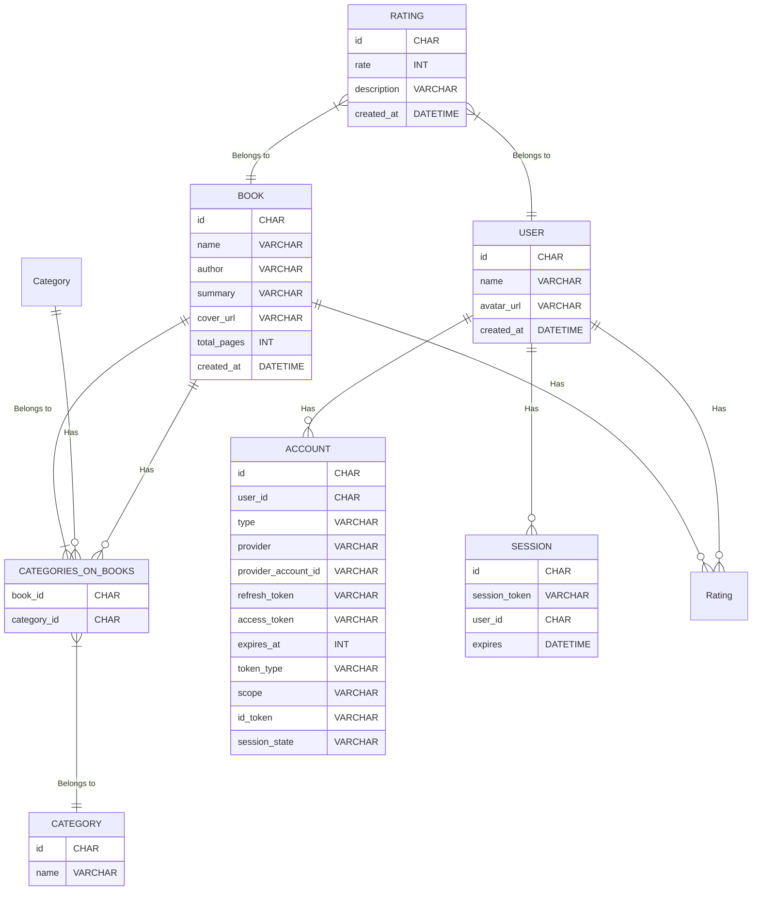

# Projeto de banco de dados para um sistema de gerenciamento de livros

Este documento apresenta um projeto de banco de dados para um sistema de gerenciamento de livros. O sistema permitirá que os usuários registrem-se, escrevam livros, avaliem livros e encontrem livros por categoria.

### O sistema será composto das seguintes entidades:

- Usuário: Um usuário é uma pessoa que usa o sistema. Um usuário pode escrever - livros, avaliar livros e encontrar livros por categoria.
- Livro: Um livro é uma obra escrita. Um livro pode ser escrito por um ou mais - usuários e pode ser classificado em uma ou mais categorias.
- Categoria: Uma categoria é um tópico ou gênero de livros. Um livro pode ser - classificado em uma ou mais categorias.
- Avaliação: Uma avaliação é uma opinião sobre um livro. Uma avaliação pode ser - feita por um ou mais usuários.
- Conta: Uma conta é uma coleção de informações sobre um usuário, incluindo o - tipo de conta, o provedor de autenticação e o identificador da conta do provedor.
- Sessão: Uma sessão é uma instância de um usuário usando o sistema. Uma sessão contém informações sobre o usuário, o livro que o usuário está visualizando e a data de expiração da sessão.

### Os relacionamentos entre essas entidades são os seguintes:

- Um usuário pode escrever muitos livros.
- Um livro pode receber muitas avaliações.
- Um livro pode pertencer a muitas categorias.
- Uma categoria pode ter muitos livros associados a ela.
- Um usuário pode ter várias contas.
- Um usuário pode ter várias sessões ativas.

### Este projeto de banco de dados é apenas um ponto de partida. O projeto real pode ser alterado de acordo com as necessidades específicas do sistema.

Aqui estão algumas considerações adicionais que devem ser feitas ao projetar o banco de dados:

O sistema deve ser projetado para escalar para um grande número de usuários e livros.
O sistema deve ser projetado para ser seguro e proteger os dados dos usuários.
O sistema deve ser projetado para ser fácil de usar e manter.

## Diagrama MER
