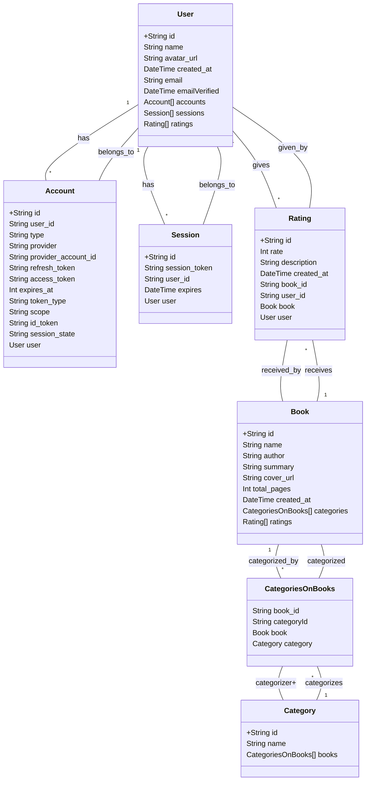

# lee

### Legendas

- has - "tem": Indica que uma instância de uma classe possui uma ou mais instâncias de outra classe. Por exemplo, um User tem várias Account.
- belongs to - "pertence a": Indica que uma instância de uma classe pertence a uma instância de outra classe. Por exemplo, uma Account pertence a um User.
- gives - "dá": Usado para indicar que uma instância de uma classe fornece algo para outra classe. Por exemplo, um User dá Rating.
- receives - "recebe": Usado para indicar que uma instância de uma classe recebe algo de outra classe. Por exemplo, um Book recebe Rating.
- categorized_by - "categorizado por": Indica que uma instância de uma classe é categorizada por outra classe. Por exemplo, um Book é categorizado por CategoriesOnBooks.
- categorizes - "categoriza": Indica que uma instância de uma classe categoriza outra classe. Por exemplo, uma Category categoriza CategoriesOnBooks.
categorized 

    