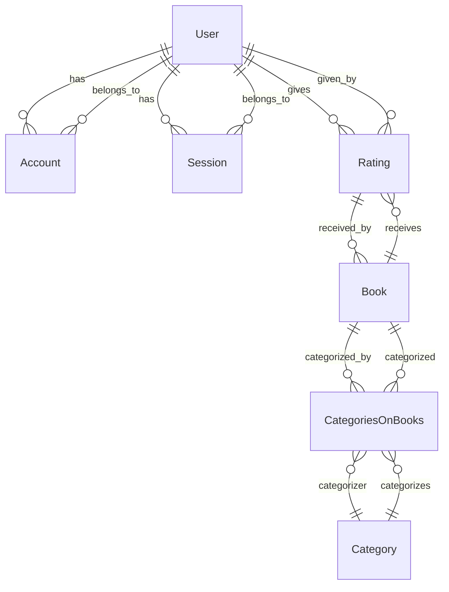

# Relacioanamentos

## Aqui estão as relações entre as entidades no seu esquema de banco de dados:

- User para Account: Um usuário pode ter várias contas. Isso é representado pela relação accounts no modelo User e pela relação user no modelo Account. Isso é uma relação de um para muitos.

- User para Session: Um usuário pode ter várias sessões. Isso é representado pela relação sessions no modelo User e pela relação user no modelo Session. Isso é uma relação de um para muitos.

- User para Rating: Um usuário pode dar várias avaliações. Isso é representado pela relação ratings no modelo User e pela relação user no modelo Rating. Isso é uma relação de um para muitos.

- Book para Rating: Um livro pode receber várias avaliações. Isso é representado pela relação ratings no modelo Book e pela relação book no modelo Rating. Isso é uma relação de um para muitos.

- Book para CategoriesOnBooks: Um livro pode ser categorizado em várias categorias. Isso é representado pela relação categories no modelo Book e pela relação book no modelo CategoriesOnBooks. Isso é uma relação de um para muitos.

- Category para CategoriesOnBooks: Uma categoria pode ser aplicada a vários livros. Isso é representado pela relação books no modelo Category e pela relação category no modelo CategoriesOnBooks. Isso é uma relação de um para muitos.

- CategoriesOnBooks é uma tabela de junção que estabelece uma relação muitos para muitos entre Book e Category. Cada registro em CategoriesOnBooks representa a associação de um livro a uma categoria.

- Espero que isso ajude a entender as relações entre as entidades no seu esquema de banco de dados. Se você tiver mais perguntas, por favor, deixe-me saber!